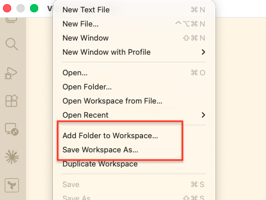
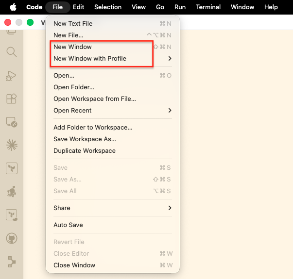

# VS Code — failid, workspace ja editorid

## Failide loomine ja avamine

- **Uus fail:** ülamenüü **File → New Text File**. Salvesta: **File → Save** — laiend (`.md`, `.json`, `.yml`) määrab süntaksi.
- **Ava fail:** **File → Open File**. Kiiremini nime järgi: **Go → Go to File** (fuzzy — ei pea algust teadma).
- **Explorerist:** **New File** ikoon Explorer'i ülaservas, või paremklõps kaustal → **New File**.

## Workspace

Workspace on **fail** (`.code-workspace`), mis hoiab meeles lahtised kaustad ja seaded. Sinna võib panna mitu kausta korraga (multi-root).

1. **File → Add Folder to Workspace** → lisa kaust.
2. Korda teise, eri asukohas kaustaga — Explorer näitab kahte juurt.
3. **File → Save Workspace As** → Desktop → `too.code-workspace`.
4. Pane kinni (**File → Close Workspace**), ava Desktopilt uuesti topeltklõpsuga → kaustad ja seaded tulevad tagasi.

*Joonis 2. Explorer kahe juurkaustaga.*

## Editorid

- **Tabid:** üks klõps failil avab **preview** tabi (nimi kaldkirjas) — järgmine fail asendab selle. Topeltklõps või muutmine teeb tabist püsiva.
- **Split:** editori paremas ülanurgas **Split Editor** ikoon, või paremklõps tabil → **Split Right**. Liigu paneelide vahel hiireklõpsuga.
- Kasulik nt config faili ja selle kasutuskoha kõrvuti hoidmiseks.

## Mitu akent korraga

Split hoiab faile **ühes** aknas. Eraldi **aknad** on kasulikud nt siis, kui üks on lokaalne ja teine remote VM.

- **Uus aken:** **File → New Window**.
- **Ava kaust uues aknas:** **File → Open Folder in New Window**, või Remote-SSH puhul **Connect in New Window**.
- **Vaheta akende vahel:** ülamenüü **Window**, või operatsioonisüsteemi aknavahetus.
- All vasakul indikaator ütleb, kas aken on lokaalne või `SSH: host`.

*Joonis 1. Kaks akent — vasak lokaalne, parem `SSH: host`.*

## Ülesanne

1. Loo Desktopile multi-root workspace kahe kaustaga, salvesta `too.code-workspace`, pane kinni ja ava uuesti.
2. Ava kaks faili kõrvuti split-editoris (Split Editor ikoon) ja liigu nende vahel.

---
