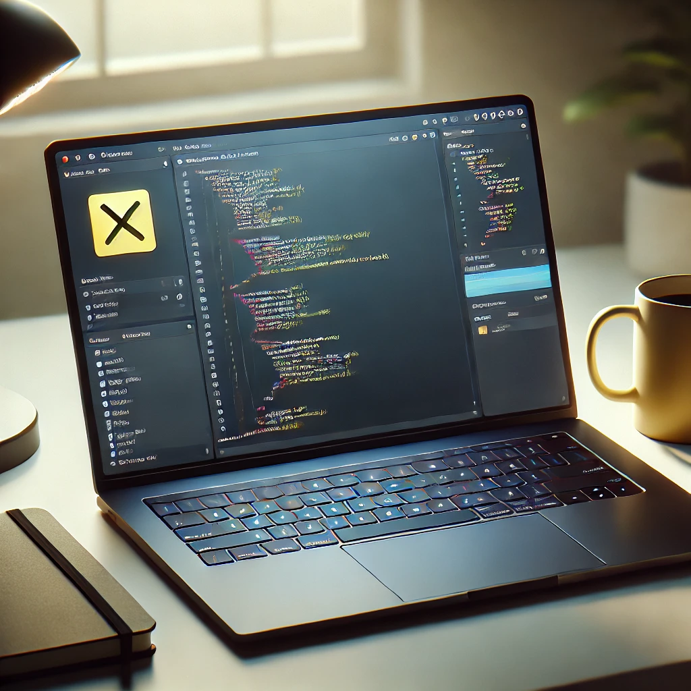
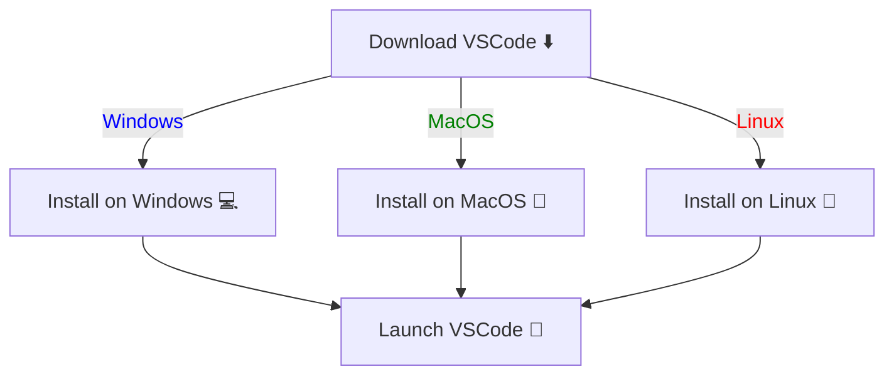
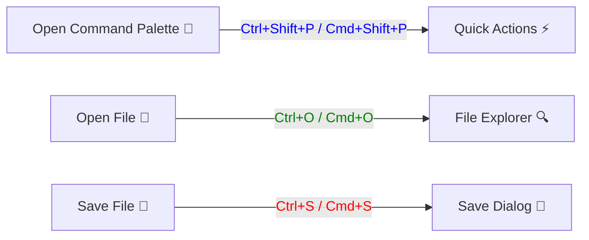
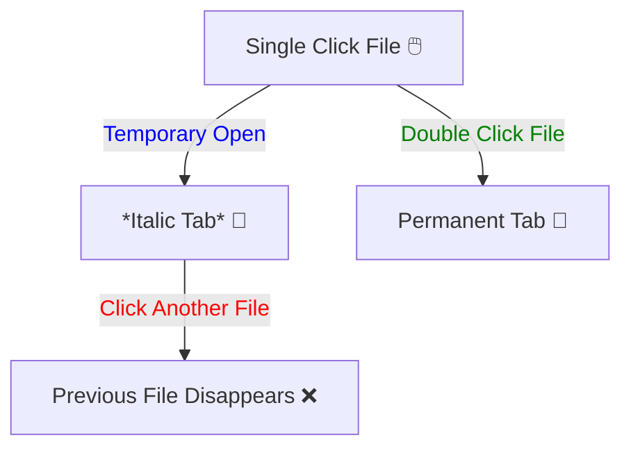
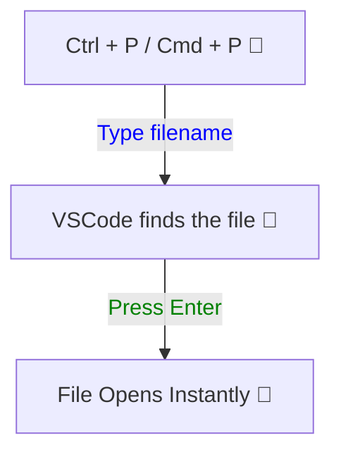

# 🚀 Section 1: Installation and Basic Set Up

## 🎯 How to Install VSCode

1. Go to the [official VSCode website](https://code.visualstudio.com/).
2. Download the right version for your system (Windows, macOS, or Linux). 🖥️
3. Run the installer and follow the setup instructions. 🔧
4. Open up VSCode and get ready to code! 🚀

## 🏁 Start Using VSCode Immediately

### 📄 Creating a New File
- Open VSCode and press `Ctrl + N` (Windows/Linux) or `Cmd + N` (Mac) to create a new file.
- Save the file using `Ctrl + S` / `Cmd + S` and pick a cool file name. 💾

### ⚡ Useful Shortcuts

- **Open a file:** `Ctrl + O` / `Cmd + O` 📂
- **Save file:** `Ctrl + S` / `Cmd + S` 💾
- **Open Command Palette:** `Ctrl + Shift + P` / `Cmd + Shift + P` 🧙‍♂️✨

### 🕵️‍♂️ Exploring the Interface

- **Explorer Panel:** Shows your project files. 🔍
- **Editor:** This is where the magic happens! ✍️
- **Terminal:** Run commands like a pro! `Ctrl + ~` 🎮
- **Extensions:** Customize your coding experience! 🛠️

## 🤹 Working with Multiple Files

### 🚀 Temporarily Opening Files (The Smart Way!)

- Click **once** on a file = **Temporary tab** (appears in *italic* 🧐).
- Click **another file** = First file disappears (poof! 💨)
- Double-click a file = **Permanent tab** (stays forever! 🏆).

### 🎯 Using the Command Palette for Speed 🚀

- `Ctrl + P` / `Cmd + P` opens **Quick File Search** 🕵️‍♀️
- Type part of a filename and VSCode **magically** finds it! 🧙‍♂️
- Press `Enter` and BOOM 💥 your file is open!

## 🎯 End of Section 1 - Exercises

### 🏗️ Exercise 1 - Installation
**Task:** Install Visual Studio Code on your preferred OS (Windows, macOS, or Linux).  
**Benefit:** Ensures you have a working setup ready for coding. ✅

### ⌨️ Exercise 2 - Shortcut Mastery
**Task:** Learn and practice using the shortcut for opening the **Command Palette**.  
**Benefit:** Mastering this (`Ctrl + Shift + P` / `Cmd + Shift + P`) will **speed up your workflow** dramatically! ⚡

### 🎨 Exercise 3 - Interface Exploration
**Task:** Customize the appearance of VSCode by changing the theme. 🌈  
**Benefit:** A personalized workspace enhances your coding experience and keeps you motivated! 🎨

### 🔍 Exercise 4 - File Navigation Challenge
**Task:** Open multiple files in VSCode and **switch between them using keyboard shortcuts**.  
**Benefit:** Learning efficient file navigation will boost your **productivity and speed**. 🏎️

---

🎉 **Good luck with the exercises!** Completing these will give you a solid foundation in installing, configuring, and navigating within VSCode, setting you up for a more **productive coding experience**! 🚀