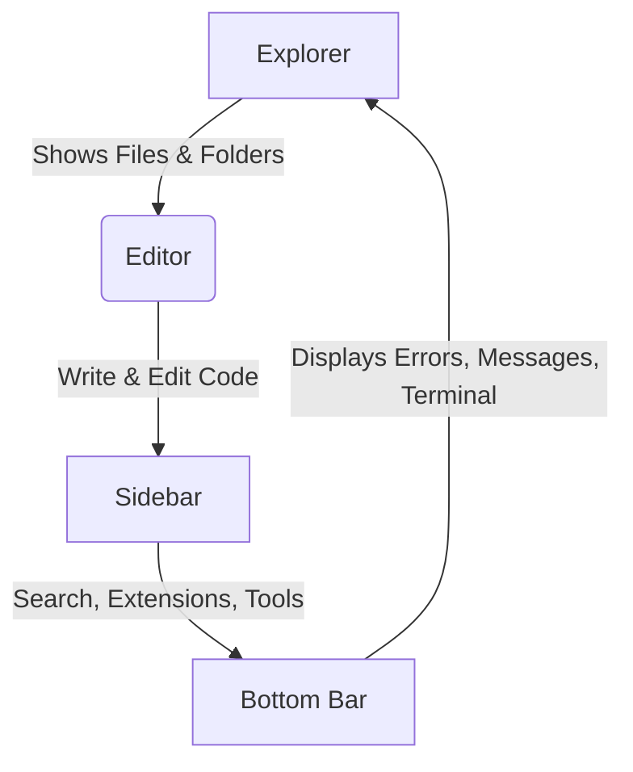
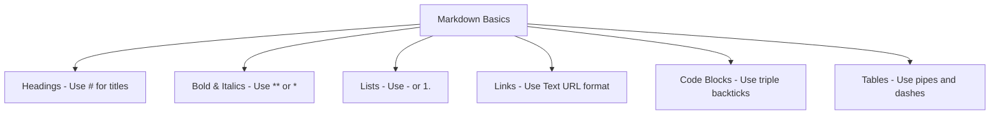

# Section 2:🚀 Interface and Tools🔥 

Wassup future coders! Ready to transform from coding newbie to VS Code ninja? Let's goooo! 🤘

## 💻 VS CODE ZONES - WHERE THE MAGIC HAPPENS

Check out these awesome areas that'll make your coding life WAY easier:



* 📁 **EXPLORER ZONE**: All your files, right where you need 'em
* ⌨️ **CODING ZONE**: Where you drop those sick lines of code
* 🧰 **TOOLBOX ZONE**: Your coding superpowers live here
* 💬 **INFO ZONE**: Errors, messages, and command center

## 👀 NEED MORE SPACE? NO PROBLEM!

* Hit **Ctrl + B** to make the side stuff disappear = INSTANT EXTRA SPACE!
* Too many panels? Hide that stuff through `View > Appearance` menu

## 📝 MARKDOWN MAGIC - MAKE YOUR NOTES LOOK EPIC

Markdown is like text messaging but with superpowers! It makes your notes and docs look professional with almost zero effort! 💯



### 🆕 MAKING A MARKDOWN FILE = SUPER EASY

* Open VS Code
* Create new file
* Save it as "something.md"
* BOOM! You've got a markdown file!

### 🔠 MARKDOWN STYLING CHEAT SHEET

* **MEGA HEADERS**:
  ```md
  # HUGE TEXT
  ## BIG TEXT
  ### MEDIUM TEXT
  ```

* **MAKE IT POP**:
  ```md
  **THIS IS BOLD & IMPORTANT**
  *This is all slanted and mysterious*
  ```

* **LISTS FOR DAYS**:
  ```md
  - First awesome thing
  - Another cool thing
  1. Step one of my master plan
  2. Step two of world domination
  ```

* **HYPERLINKS**:
  ```md
  [Click here for cat videos](https://www.youtube.com)
  ```

* **CODE BLOCKS**:
  ```md
  ```python
  def epic_function():
      print("This code is fire! 🔥")
  ```

## 🎮 LEVEL-UP CHALLENGES - TEST YOUR SKILLS!

Ready to prove you're not just a noob? Try these challenges!

### 🥋 CHALLENGE 1: MULTI-SCREEN MASTERY

**MISSION:** Split your screen into multiple parts and flip between them using ONLY keyboard shortcuts.

**WHY IT'S COOL:** You'll look like a hacker in a movie, plus you can work on different code at the same time!

### 🖥️ CHALLENGE 2: TERMINAL DOMINATION

**MISSION:** Use the built-in terminal to run commands and navigate your project.

**WHY IT'S COOL:** Terminal skills = instant coding cred. Plus you'll get stuff done WAY faster!

### 📋 CHALLENGE 3: MARKDOWN MASTERMIND

**MISSION:** Create an epic markdown file with headers, lists, and code examples.

**WHY IT'S COOL:** Your project documentation will look professional instead of boring!

### ⚡ CHALLENGE 4: NO-MOUSE MARATHON

**MISSION:** Edit code using ONLY keyboard shortcuts - NO TOUCHING THE MOUSE!

**WHY IT'S COOL:** Your coding speed will literally double once you master this!

## GO CRUSH IT! 💪

These skills will make you stand out from other beginners and set you up to become a coding legend. Time to show off what you can do! 🏆