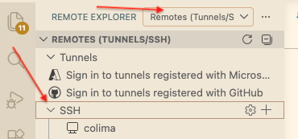
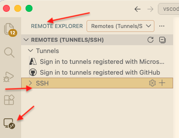
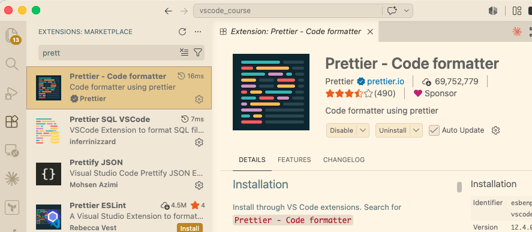

# VS Code — laiendused: Remote-SSH, Remote Explorer, Prettier

## Laienduse paigaldamine

Ava **Extensions** vaade — Activity Bar'i **klotside** ikoon vasakul. Otsi nime järgi, vajuta **Install**. Populaarsuse (installide arv) järgi näed, mis on laialt kasutusel.

## Remote - SSH

Võimaldab töötada kaugmasinal (VM) nii, nagu see oleks lokaalne.

**SSH võti (kui veel pole).** Genereeri võti ja kopeeri see VM-i (terminalis):
```bash
ssh-keygen -t ed25519
ssh-copy-id <eesnimi>@192.168.35.12X
ssh <eesnimi>@192.168.35.12X   # testi, et sisse saad ilma paroolita
```

1. Installi laiendus **Remote - SSH** (Microsoft).
2. Nimeta masin `~/.ssh/config`-is:
   ```ssh-config
   Host lab-vm
       HostName 192.168.35.12X
       User <eesnimi>
       IdentityFile ~/.ssh/id_ed25519
   ```
3. All vasakul **Remote** ikoon (`><`) → **Connect to Host** → `lab-vm`. (Sama valik on Remote Explorer vaates.)
4. Kui all vasakul on `SSH: lab-vm`, oled sees. **File → Open Folder** avab VM-i failisüsteemi.


*Joonis 1. Indikaator all vasakul: `SSH: lab-vm`.*

Remote'is töötades tuleb teised laiendused (nt Prettier) installida **VM-i poolele** — Extensions vaates on nupp **Install in SSH: lab-vm**.

## Remote Explorer

Activity Bar'i vaade, mis loetleb kõik su SSH-sihtmärgid.

- Ava Remote Explorer (ekraani ikoon Activity Bar'is), ülal vali **SSH**.
- `~/.ssh/config`-i `Host`-id ilmuvad loendisse.
- Klõpsa sihtmärgil → **Connect** (samasse või uude aknasse).


*Joonis 2. Remote Explorer — SSH-sihtmärgid loendis.*

## Prettier — code formatter

Vormindab koodi ühtlaselt (taanded, jutumärgid, reavahetused) automaatselt.

1. Installi laiendus **Prettier - Code formatter** (esbenp).
2. Vorminda fail käsitsi: paremklõps failis → **Format Document**.
3. Vorminda automaatselt salvestamisel — ava seaded (**File → Preferences → Settings**), otsi `format on save` ja lülita sisse; määra default formatter Prettier'iks. (Või JSON-vaates:)
   ```json
   {
     "editor.formatOnSave": true,
     "editor.defaultFormatter": "esbenp.prettier-vscode"
   }
   ```

Prettier vormindab nt JSON, YAML, Markdown ja CSS faile.


*Joonis 3. Format on Save seaded.*

## Profiles

Profile on eraldi komplekt laiendusi ja seadeid. Kasulik, kui eri kursustel/projektidel on erinevad tööriistad ja sa ei taha, et need seguneksid.

1. All vasakul **hammasratta** ikoon → **Profiles → Create Profile**.
2. Anna nimi (nt `vscode-kursus`), vali mida kaasata (laiendused, seaded).
3. Vaheta profiili: sama hammasratta ikoon → **Profiles** → vali profiil.

Profiili saab siduda konkreetse workspace'iga — siis vahetub see automaatselt, kui selle projekti avad.

## Ülesanne

1. Installi Prettier.
2. Loo segase taandega `.json` fail ja vorminda see paremklõps → **Format Document**.
3. Lülita **Format on Save** sisse ja veendu, et salvestamine vormindab faili.
4. Ühendu Remote-SSH kaudu VM-iga ja installi Prettier ka **VM-i poolele**.


---
