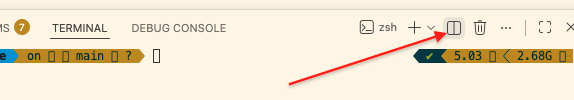
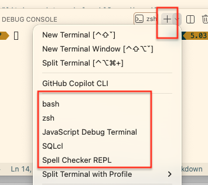
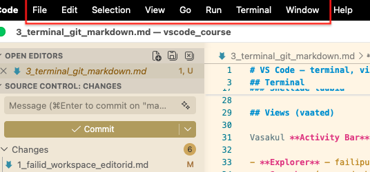
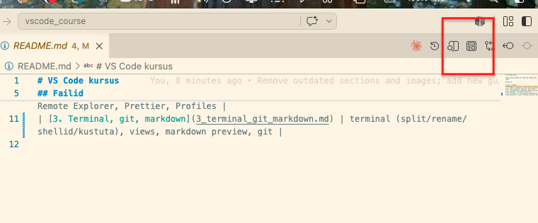
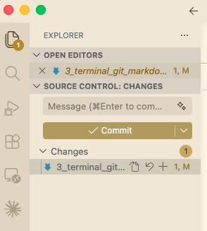

# VS Code — terminal, views, markdown, git

## Terminal

Integreeritud terminal jookseb VS Code'i sees — pole vaja eraldi akent.

- **Ava:** ülamenüüst **Terminal → New Terminal**. Terminal avaneb all paneelis.
- **Uus terminal:** terminali paneeli paremas ülanurgas **+** ikoon. Iga uus on eraldi — kõik on loetletud paremal loendis.
- **Vaheta terminalide vahel:** klõps nimel paremas loendis.
- **Split:** terminali paneelis **Split** ikoon (kaks kasti kõrvuti) → kaks shelli kõrvuti samas paneelis.
- **Rename:** paremklõps terminali nimel loendis → **Rename**. Kasulik, kui üks on lokaalne, teine mingi teenuse jaoks.
- **Kustuta:** hõljuta terminali nime kohal loendis → **prügikasti** ikoon tapab protsessi. Paneeli sulgemine (**X** ülanurgas) ainult peidab — protsess jääb tööle.

*Joonis 1. Split terminal — kaks shelli kõrvuti, loend paremal.*

### Shellide tüübid

**+** ikooni kõrval oleva **noole** alt saab valida, mis shell käivitub: **bash**, **zsh**, **PowerShell**, **cmd**.

- Vali default: paremklõps terminalis → **Select Default Profile** (või hammasratta ikoon terminali paneelis).
- Uued terminalid avanevad edaspidi selle shelliga.

*Joonis 2. Shellide dropdown — bash, zsh, PowerShell, cmd.*

Remote-SSH aknas avaneb terminal automaatselt **VM-i shellis** — ei pea eraldi `ssh` käsku kirjutama.

## Views (vaated)

Vasakul **Activity Bar** (ikoonide riba) lülitab vaadete vahel — klõpsa ikoonil:

- **Explorer** — failipuu.
- **Search** (suurendusklaas) — otsi üle kõigi failide.
- **Source Control** (hargnemise ikoon) — git.
- **Extensions** (klotsid) — laiendused.
- **Remote Explorer** (ekraan) — SSH-sihtmärgid (kui Remote-SSH installitud).

Sidebar'i peida/näita: **View → Appearance → Primary Side Bar**. Kõik käsud leiab ülamenüüst või paremklõpsu menüüdest.

*Joonis 3. Activity Bar — vaadete ikoonid vasakul.*

## Markdown

- **Preview:** ava `.md` fail → tabi paremas ülanurgas **eelvaate** ikoon (suurendusklaasiga leht) avab renderdatud vaate.
- **Preview kõrvale:** sama ikoon, `Alt`-iga klõps — allikas vasakul, preview paremal, keritakse koos. Või paremklõps failinimel tabis → **Open Preview to the Side**.
- Toetab GitHub-stiilis markdownit (tabelid, koodiblokid, checkbox'id).

*Joonis 4. Markdown allikas vasakul, preview paremal.*

## Git

Source Control vaade (Activity Bar'i **hargnemise ikoon**) näitab muudetud faile ilma terminalita.

1. Muudetud failid ilmuvad **Changes** alla. Klõps failil → diff kõrvuti (vana vs uus).
2. **Stage:** vii hiir faili kohale → **+** ikoon (või kõigil korraga **Changes** rea juures).
3. **Commit:** kirjuta sõnum ülaossa, vajuta **linnukese** nuppu.
4. **Push/pull:** all olekuribal **sünkroonimise** ikoon, või **⋯** menüü → **Push**.

Uus repo: Source Control vaates nupp **Initialize Repository**.

*Joonis 5. Source Control — muudetud failid, stage ja commit.*

## Ülesanne

1. Ava terminal menüüst, tee **split**, jäta ühte `bash` ja vali noole alt teise teine shell.
2. **Rename** üks terminal ümber ja **kustuta** (prügikast) teine.
3. Kirjuta `.md` fail paari reaga, ava **Open Preview to the Side** paremklõpsuga.
4. Tee kaustast git repo (**Initialize Repository**), muuda faili, **stage + commit** ainult Source Control vaatest — ilma terminalita.

---
