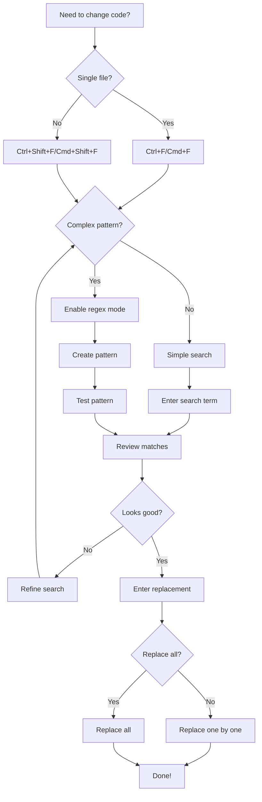

# Section 4: 🔍 Find & Replace Power Tools

## 📚 Theory: Understanding Find & Replace in VSCode

Hey there, future code champion! Let's dive into some **AWESOME** tricks that will make you a VSCode ninja! These find & replace superpowers will save you TONS of time and make your coding life so much easier!

### What is Find & Replace? 🤔

Find & Replace is one of the most essential tools in a developer's toolkit. It allows you to:
- 🔎 Search for specific text or patterns in your code
- 🔄 Replace instances of that text with something else
- 📊 View all matches at once and navigate between them
- 🧮 Apply changes to one file or across your entire project

As your projects grow larger, manual editing becomes tedious and error-prone. Find & Replace is your time-saving superpower! 💪

## 📘 Theory Part 1: Finding in a Single File

When working in Visual Studio Code, you can search within your current file using the Find feature. This is useful when you need to locate specific variables, functions, or any text within the file you're currently editing.

### Key Concepts:
- **Find Box**: Opens with Ctrl+F (Cmd+F on Mac), showing a small popup search box
- **Highlights**: VSCode highlights all matches and shows them in the minimap and scrollbar
- **Navigation**: You can move between matches using the up/down arrows in the find box
- **Match Count**: VSCode shows how many matches were found (e.g., "1 of 4")
- **Selection Only**: You can limit your search to only the selected text
- **Match Options**: You can match case or whole words for more precise searches

The find box in a single file is perfect for quick navigation and editing within your current working file.

## 🔥 Exercise 1: Basic Find & Replace Magic

### Single File Searching 📄
- Hit `Ctrl+F` (Windows/Linux) or `Cmd+F` (Mac) to open search
- Type your search term and watch VSCode highlight all matches!
- Look at the minimap (right sidebar) to see all matches at once
- Use the up/down arrows ⬆️⬇️ to jump between matches
- Click the little arrow icon to open replace mode
- Replace one by one or all at once!

### Pro Tips 💯
- Use the "Match Case" option when you need exact capitalization
- "Match Whole Word" helps avoid partial matches
- "Find in Selection" is perfect when you only want to search part of your file

```
🎯 CHALLENGE:
1. Open any code file
2. Search for a common word like "function" or "const"
3. Try replacing ONE instance with "myAwesomeFunction"
4. Now try using "Match Whole Word" and see the difference!
```

## 📗 Theory Part 2: Finding Across Multiple Files

As projects grow, you'll often need to search for text across multiple files. Visual Studio Code provides powerful functionality for this through the Search sidebar.

### Key Concepts:
- **Search Sidebar**: Access by clicking the search icon in the sidebar or pressing Ctrl+Shift+F (Cmd+Shift+F on Mac)
- **Project-Wide Search**: Searches through all files in your workspace
- **Results View**: Displays all matching files with line numbers and previews
- **Temporary File Opening**: Clicking a result opens the file temporarily (shown in italics)
- **Filtering Options**: You can include/exclude files from search
- **Search Results**: Can be saved for future reference

This functionality is particularly useful when refactoring code, finding usages of functions or variables, or when you need to make consistent changes across your entire project.

## 🌐 Exercise 2: Project-Wide Find & Replace

When you need to find something across MULTIPLE files:
- Use `Ctrl+Shift+F` (Windows/Linux) or `Cmd+Shift+F` (Mac)
- Type your search term to find it across your ENTIRE project! 🤯
- Results will show file paths and line numbers
- Click any result to jump straight to that location
- Add a replace term to change code across your whole project!

### Pro Tips 💯
- Use the folder selection dropdown to narrow your search
- Include/exclude patterns help you search only certain file types
- You can save searches for later by clicking "Save Search"

```
🎯 CHALLENGE:
1. Open a multi-file project
2. Search for a term you know exists in several files
3. Replace it with something new across ALL files
4. Verify changes were made correctly
```

## 🧠 Exercise 3: Regex Superpowers

Regular expressions (regex) give you ULTIMATE POWER for complex searches!

### Basic Regex Patterns
- `.` - Any single character
- `\d` - Any digit (0-9)
- `\w` - Any word character (a-z, A-Z, 0-9, _)
- `*` - Match 0+ of the previous character
- `+` - Match 1+ of the previous character
- `{n}` - Match exactly n of the previous character

### Grouping & Replacing
- Use `()` to create capture groups
- Reference groups in your replace with `$1`, `$2`, etc.

```
🎯 CHALLENGE: Number Formatter
1. Create a file with numbers like "1000000" and "5000000"
2. Use regex pattern: `(\d{3})(\d{3})`
3. Replace with: `$1_$2`
4. Watch as 1000000 becomes 100_000!
```

## 🎭 Fun Regex Examples

### Email Finder
Pattern: `\b[A-Za-z0-9._%+-]+@[A-Za-z0-9.-]+\.[A-Z|a-z]{2,}\b`

### URL Finder
Pattern: `https?://[^\s]+`

### Magic Number Finder (6+ digits)
Pattern: `\b\d{6,}\b`

## 🧜‍♀️ Mermaid Chart: Find & Replace Workflow



## 🚀 Next-Level Tips

- Use multiple cursors with find: Select a match and press `Ctrl+D` to add the next match
- Save complex regex patterns in a note for reuse
- For large projects, limit searches to specific directories
- Combine regex with "files to include/exclude" for even more power

Now go forth and search like a pro! 🏆