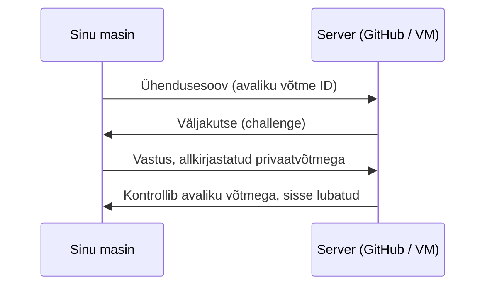
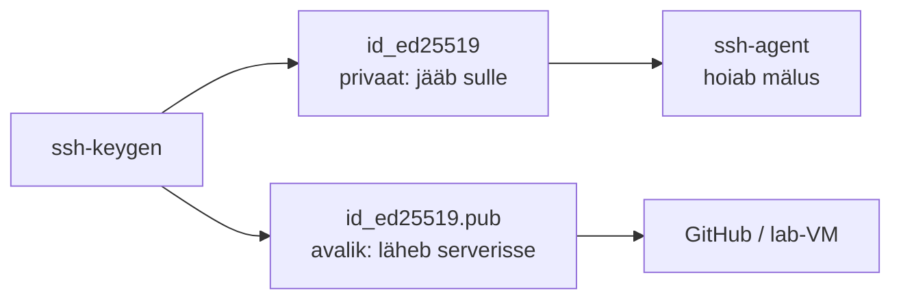
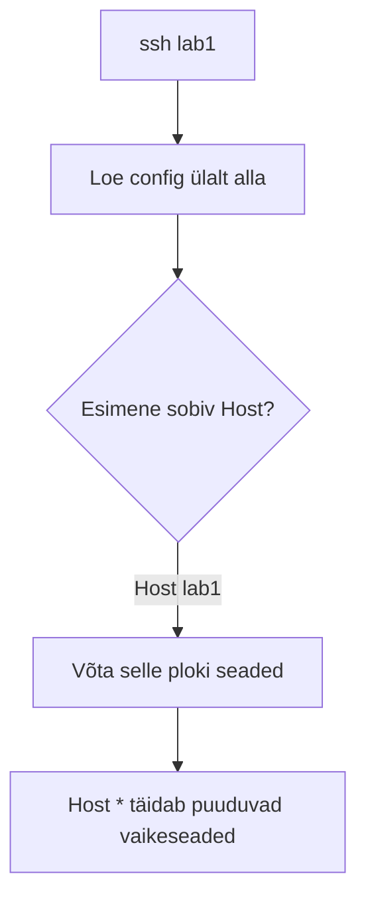
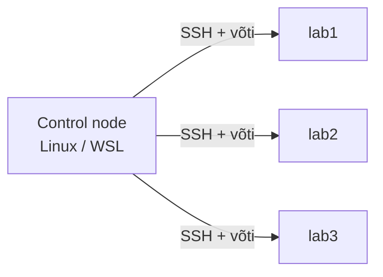
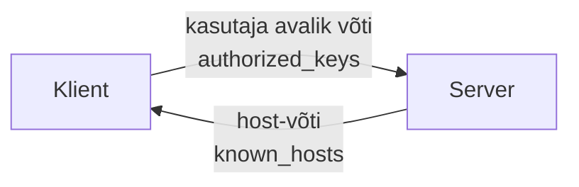

---
tags:
  - SSH
  - Git
  - GitHub
  - Ansible
---

# SSH: GitHub ja lab-masinad

**Privaatvõti** (`id_ed25519`) jääb su masinasse, **avalik võti** (`id_ed25519.pub`) läheb serverisse — GitHubi või lab-VM-i. Parool ei liigu üle võrgu. Sama võti töötab kõigi serveritega: loo üks kord, lisa kuhu vaja.

<figure markdown="span">

  <figcaption>Joonis 1. SSH-võtmepaari autentimine (Talvik, 2025).</figcaption>
</figure>

---

# Võtme seadistamine

Windows (Git Bash) ja Linux.

<figure markdown="span">

  <figcaption>Joonis 2. Võtme loomine ja kuhu kumbki pool läheb (Talvik, 2025).</figcaption>
</figure>

**1. Kontrolli** olemasolevaid võtmeid — kui `id_ed25519.pub` on, mine sammu 3 juurde:

```bash
ls -al ~/.ssh
```

**2. Loo** võti (küsib asukoha ja passphrase'i):

```bash
ssh-keygen -t ed25519 -C "sinu.email@naide.ee"
```

**3. Lisa agenti:**

```bash
eval "$(ssh-agent -s)"
ssh-add ~/.ssh/id_ed25519
```

**4. Kopeeri avalik võti** (`.pub`, mitte privaat):

=== "Linux"
    ```bash
    xclip -selection clipboard < ~/.ssh/id_ed25519.pub
    ```

=== "Windows (Git Bash)"
    ```bash
    clip < ~/.ssh/id_ed25519.pub
    ```

**5. Lisa GitHubi:** Settings → SSH and GPG keys → New SSH key → Title + kleebi → Add SSH key.

**6. Testi** (kinnita fingerprint `yes`, vastus algab su kasutajanimega):

```bash
ssh -T git@github.com
```

**7. Kasuta:**

```bash
git clone git@github.com:kasutaja/repo.git
git remote set-url origin git@github.com:kasutaja/repo.git   # HTTPS-repo SSH peale
```

---

# Seadistusfail (~/.ssh/config)

SSH loeb ülalt alla; iga seade võetakse **esimesest sobivast** `Host`-plokist. Konkreetsed hostid üleval, `Host *` (kehtib kõigile) all.

<figure markdown="span">

  <figcaption>Joonis 3. Kuidas SSH config-plokke sobitab (Talvik, 2025).</figcaption>
</figure>

```text
Host github.com
    HostName github.com
    User git
    IdentityFile ~/.ssh/id_ed25519

Host github-kool
    HostName github.com
    User git
    IdentityFile ~/.ssh/id_ed25519_kool
    IdentitiesOnly yes

Host lab1
    HostName 10.0.0.11
    User student

Host lab-privaat
    HostName 10.0.0.50
    User student
    ProxyJump student@jumpbox

Host *
    AddKeysToAgent yes
    ServerAliveInterval 60
```

Nüüd `ssh lab1` asendab `ssh student@10.0.0.11`; `git clone git@github-kool:org/repo.git` kasutab kooli võtit.

---

# Lab-masin ja Ansible

Vii avalik võti VM-i (üks kord, küsib parooli), siis logi ilma paroolita:

```bash
ssh-copy-id -i ~/.ssh/id_ed25519.pub student@10.0.0.11
ssh lab1
```

Ansible kasutab sama SSH-d — kui `ssh lab1` töötab, töötab ka Ansible.

!!! info "Control node"
    Ansible ei tööta Windowsis natiivselt — käivita WSL-i (Ubuntu) alt. Control node = Linux/WSL, hallatavad = Linux-VM-id.

<figure markdown="span">

  <figcaption>Joonis 4. Ansible juhib Linux-VM-e üle SSH (Talvik, 2025).</figcaption>
</figure>

`inventory.ini`:

```ini
[lab]
lab1 ansible_host=10.0.0.11
lab2 ansible_host=10.0.0.12

[lab:vars]
ansible_user=student
```

Test (`pong` = OK, `UNREACHABLE` = SSH-viga → testi `ssh lab1` käsitsi):

```bash
ansible -i inventory.ini lab -m ping
```

Jumpboxi taga piisab `config`-i `ProxyJump` reast — Ansible loeb sama faili.

---

# Serveri pool (sshd)

Kliendil on võtmed ja `config`; serveril töötab **sshd** oma failidega:

- `/etc/ssh/sshd_config` — kes ja kuidas tohib sisse.
- `/etc/ssh/ssh_host_ed25519_key(.pub)` — serveri **enda** identiteet; selle fingerprint läheb kliendi `known_hosts`-i.
- `~/.ssh/authorized_keys` — lubatud avalikud võtmed.

Host-võti tõestab serverit sulle, kasutaja võti sind serverile — kaks eri võtit.

<figure markdown="span">

  <figcaption>Joonis 5. Kahepoolne usaldus: kes keda tõestab (Talvik, 2025).</figcaption>
</figure>

Olulised `sshd_config` read:

```text
PermitRootLogin no
PubkeyAuthentication yes
PasswordAuthentication no        # ainult võtmepõhine
AllowUsers student
```

Jõustamine:

```bash
sudo sshd -t && sudo systemctl restart ssh
```

!!! warning
    Enne `PasswordAuthentication no` veendu, et võtmega sisenemine töötab — muidu lukustad end välja.

---

# Teatmik

**Võtmetüübid:** `ed25519` (vaikimisi), `rsa -b 4096` (ainult vana süsteem), `ecdsa`/`dsa` ei.

**Failiõigused** (SSH keeldub liiga lahtisest võtmest):

```bash
chmod 700 ~/.ssh
chmod 600 ~/.ssh/id_ed25519 ~/.ssh/config      # ja serveris authorized_keys
chmod 644 ~/.ssh/id_ed25519.pub
```

**Tõrkeotsing** (`ssh -vT git@github.com` näitab, kus kinni jääb):

| Probleem | Lahendus |
|---|---|
| `Permission denied (publickey)` | `ssh-add -l`; kontrolli `.pub` GitHubis/`authorized_keys`-is |
| `Permissions ... too open` | `chmod 600 ~/.ssh/id_ed25519` |
| `Could not open a connection to your authentication agent` | `eval "$(ssh-agent -s)"` |
| `Host key verification failed` | eemalda vana rida `known_hosts`-ist |
| Ansible `UNREACHABLE` | testi `ssh host` käsitsi, kontrolli `ansible_host` |

*Tabel 1. Levinumad probleemid*

---

# Enesekontroll

??? question "1. Milline fail läheb serverisse?"
    `.pub` (avalik). Privaat jääb sulle.

??? question "2. Mis järjekorras loeb SSH config-faili?"
    Ülalt alla, esimene sobiv `Host` võidab. `Host *` all.

??? question "3. Ansible `UNREACHABLE` — kust alustad?"
    `ssh host` käsitsi. Kui ei tööta, on viga SSH-s.

??? question "4. Host-võti vs kasutaja võti?"
    Host-võti tõestab serverit sulle (`known_hosts`), kasutaja võti sind serverile (`authorized_keys`).

---

# Allikad

- GitHub. *Connecting to GitHub with SSH*. <https://docs.github.com/en/authentication/connecting-to-github-with-ssh>
- GitHub. *Troubleshooting SSH*. <https://docs.github.com/en/authentication/troubleshooting-ssh>
- Ansible. *Connection details*. <https://docs.ansible.com/ansible/latest/inventory_guide/connection_details.html>
